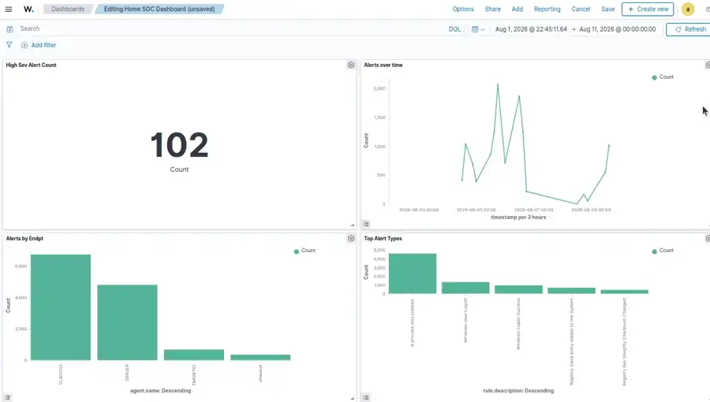
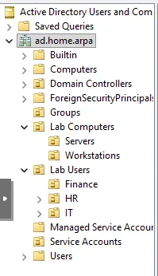

# Cybersecurity Home Lab

A multi-host Proxmox IT and cybersecurity lab built to practice Windows domain administration, endpoint monitoring, SIEM analysis, network segmentation, controlled attack simulation, and secure remote access.

## Project Goals

- Build and administer a small Windows Active Directory environment.
- Centralize endpoint telemetry with Wazuh.
- Collect Windows security, Sysmon, PowerShell, Defender, and file-integrity events.
- Separate attacker infrastructure from the normal home LAN.
- Validate detections with controlled Kali Linux activity.
- Provide secure remote administration without exposing Proxmox or Wazuh directly to the public internet.

## Architecture

The lab is split across two independent Proxmox hosts.

### Main Proxmox host

- **DC01 / SERVER** — Windows Server domain controller, DNS, Group Policy
- **CLIENT01** — Windows 11 Pro domain-joined workstation
- **WAZUH01** — Ubuntu-based Wazuh manager, indexer, dashboard, and Tailscale subnet router

### Secondary Proxmox host

- **KALI01** — Kali Linux attacker VM
- **TARGET01** — Ubuntu Server monitored target

The attack environment uses an isolated Proxmox bridge (`vmbr1`) on the secondary host. KALI01 is connected only to this network. TARGET01 has one interface on the isolated network and a second management interface so it can send telemetry to WAZUH01.

```text
                         Internet
                            |
                      Home Router/LAN
                       192.168.1.0/24
                            |
            +---------------+----------------+
            |                                |
      Main Proxmox                     Secondary Proxmox
            |                                |
     +------+------+                  +------+------+
     |      |      |                  |             |
   DC01  CLIENT01 WAZUH01          TARGET01      KALI01
                  + Tailscale          |             |
                                      +------vmbr1---+
                                          192.168.50.0/24
```

See [`docs/architecture.md`](docs/architecture.md) for details.

## Technologies

- Proxmox VE
- Windows Server 2025
- Active Directory Domain Services
- DNS and Group Policy
- Windows 11 Pro
- Wazuh SIEM/XDR
- Sysmon
- Microsoft Defender telemetry
- PowerShell Script Block Logging
- File Integrity Monitoring (FIM)
- Ubuntu Server
- Kali Linux
- Nmap and SSH
- Tailscale

## Active Directory

The Windows environment uses the lab domain:

```text
ad.home.arpa
```

Key administration work included:

- Domain controller deployment and DNS configuration
- Organizational Units for users, workstations, servers, groups, and service accounts
- Domain user and administrative accounts
- Windows 11 domain join
- Workstation and domain-controller Group Policy baselines
- PowerShell Script Block Logging
- Process-creation auditing and command-line logging

See [`docs/active-directory.md`](docs/active-directory.md).

## Wazuh Monitoring

WAZUH01 provides centralized monitoring for the Windows endpoints and TARGET01.

Implemented telemetry includes:

- Windows Security Event Logs
- Sysmon
- Microsoft Defender events
- PowerShell Operational logs
- File and Registry Integrity Monitoring
- Linux authentication events
- Linux file-integrity events
- Agent grouping and endpoint-role labels
- Threat Hunting views and a custom SOC dashboard

Windows agents are grouped by role, including workstation and domain-controller groups. TARGET01 is monitored as a Linux attack target.

See [`docs/wazuh.md`](docs/wazuh.md).

## Lab Evidence

### Custom SOC dashboard



The dashboard summarizes high-severity alerts, alert volume over time, activity by endpoint, and common alert types.

### Active Directory organization



The domain is organized into purpose-built OUs for users, computers, groups, and service accounts.

### Workstation security baseline


The workstation GPO includes account-lockout controls and process-creation auditing.

Additional virtualization screenshots are available in [`screenshots/`](screenshots/README.md).

## Controlled Detection Testing

Testing was performed only against systems owned and configured for this lab.

| Test | Source | Target | Result |
|---|---|---|---|
| Nmap service scan | KALI01 | TARGET01 | Identified reachable host and exposed services |
| Failed SSH authentication | KALI01 | TARGET01 | Authentication failures visible in Wazuh |
| Successful SSH login | KALI01 | TARGET01 | Login activity recorded for comparison |
| File modification | TARGET01 | `/LabMonitored` | Add/modify/delete events detected by FIM |
| Temporary Linux user creation | TARGET01 | `/etc/passwd`, `/etc/group`, `/etc/shadow` | Sensitive account-file changes detected |
| Defender/EICAR test | CLIENT01 | Windows Defender | Defender activity ingested into Wazuh |
| Registry Run-key modification | CLIENT01 | Windows Registry | Registry FIM events detected |
| PowerShell activity | Windows endpoints | PowerShell | Script Block Logging events collected and alerted |

See [`docs/attack-lab.md`](docs/attack-lab.md) and [`configs/detection-tests.md`](configs/detection-tests.md).

## Network Segmentation

The lab deliberately separates attacker traffic from the normal home LAN.

- `vmbr0` — management/home network
- `vmbr1` — isolated attack network
- KALI01 — `192.168.50.10/24`
- TARGET01 attack interface — `192.168.50.20/24`
- No gateway is configured on KALI01's attack interface
- Linux IP forwarding remains disabled on TARGET01 to prevent it from routing Kali traffic into the management network

This allows TARGET01 to report to Wazuh while KALI01 remains isolated from the home LAN.

## Secure Remote Access

Tailscale runs on WAZUH01 and advertises the management subnet as a subnet router. This allows remote access to Proxmox and lab services without public port forwarding.

The isolated `192.168.50.0/24` attack network is intentionally **not** advertised through Tailscale.

See [`docs/remote-access.md`](docs/remote-access.md).

## Repository Layout

```text
.
├── README.md
├── docs/
│   ├── architecture.md
│   ├── active-directory.md
│   ├── wazuh.md
│   ├── attack-lab.md
│   ├── remote-access.md
│   ├── backup-recovery.md
│   └── lessons-learned.md
├── configs/
│   ├── wazuh-fim-example.xml
│   └── detection-tests.md
├── diagrams/
│   └── README.md
└── screenshots/
    └── README.md
```

## Current Status

Core infrastructure, Active Directory, Wazuh telemetry, dashboarding, isolated Kali/TARGET01 networking, controlled detection tests, and Tailscale remote access have been implemented. Suricata/network IDS integration is being kept as a future extension.

Backup/restore documentation is included as a validation checklist and should be updated with screenshots/results after the final restore test.

## Security Notes

This repository intentionally excludes credentials, authentication keys, private certificates, raw Wazuh databases, VM disks, and other secrets. All attack simulation is limited to systems owned and isolated for this lab.
