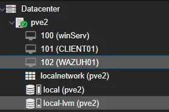
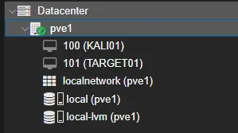

# Lab Screenshots

Selected screenshots provide visual evidence of the lab's virtualization, Windows administration, Group Policy, and SIEM monitoring components.

## Multi-host Proxmox

### Main host

Runs the Windows Server domain controller, CLIENT01, and WAZUH01.

### Attack-lab host

Runs KALI01 and TARGET01 as the isolated attack/testing environment.

## Active Directory

The `ad.home.arpa` domain is organized into dedicated OUs for lab users, computers, groups, and service accounts.

## Group Policy

The workstation baseline demonstrates security configuration including account lockout controls and process-creation auditing.

## Wazuh SOC Dashboard

The custom dashboard summarizes alert volume, endpoint activity, high-severity alerts, and common alert types across the monitored lab.

## Screenshot Safety

Screenshots containing personal account information, email addresses, credentials, tokens, or other unnecessary identifying information are intentionally excluded from the public repository. Internal RFC1918 lab addresses may be shown where they help explain the architecture.
